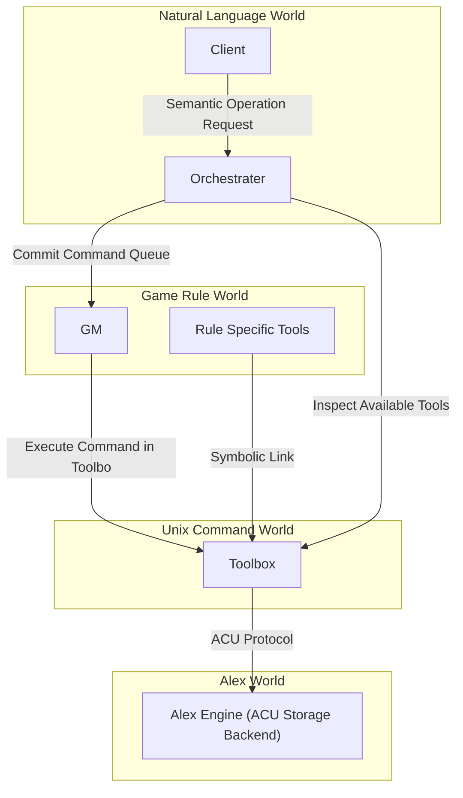
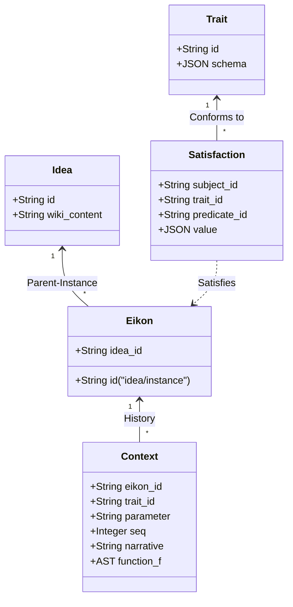

Alexは、言語・意味・状態遷移をUnix哲学に基づいて管理するための知識・状態管理プロトコルである。

本規格では、Alexのデータオントロジーと、Alex Worldを読み書きする唯一の公開規格である Alex Core Utilitiesコマンドプロトコルを定義する。

## 概念オントロジー
Alex Worldのすべての実体と関係は、以下の5つのコア概念によって表現される。

### Trait
データ構造および意味的制約の定義。文における動詞、特にbeや所属関係にあたる。主語単独の属性定義のみならず、主語と述語の間の2項関係、たとえば所属、位置、装備、友好度などを定義する。`[a-zA-Z0-9_-]+`という命名規則に準ずる。

### Idea
単一の抽象概念。Wikiドキュメントと、その概念が持っている静的なTrait充足を保持する。`[a-zA-Z0-9_-]+`という命名規則に準ずる。

### Eikon
Ideaから派生した個別具象実体。親Ideaとの親子関係をID自体に内包する。そのため、命名規則は`[a-zA-Z0-9_-]+/[a-zA-Z0-9_-]+`となる。Traitは動的な付与および剥奪が可能。パラメータの時間的変化の因果履歴をContextとして保持する。

### Satisfaction
ある主語が、Traitによって定義された条件を満たしている状態。すなわち、知識グラフのタプル`(Subject, Trait, [Predicate], [Value/AST])`である。述語が存在する2項関係の場合、主語と述語の双方向から照会可能なリレーショナルタプルとして成立する。

### Context
パラメータの変化をスカラー値の上書きではなく、文脈付き関数 $f(x)$ の構文木の時系列シーケンスとして保持する。初期値はTrait充足時の定義値としたとき、$x$ は前回の評価値を示し、値の変化を関数合成の歴史として追跡可能にする。これにより、状態の監査可能性と因果性の説明可能性を保証する。

## Alex Core Utilities コマンドプロトコル
Alex Worldに対するすべての操作は、ACUが提供する標準CLIプロトコルを通じて行われなければならない。外部ツールやゲームルールスクリプトが、バックエンドの物理ストレージを直接走査・変更する設計である場合、ACUの実装を変更した場合の結果の同一性は保証されない。

### 識別子・オントロジー管理
#### `areg [-t] [-i] [-e <idea-id> [-id <instance-id>]]`
Alex Register。新しい要素を世界に登録し、発行されたIDを標準出力に返却する。

- `-t`: 標準入力からTraitスキーマJSONを読み込み、新規Trait IDを発行・登録する。
- `-i [-id <name>]`: 新規Ideaを発行・登録する。`-id` 省略時は自動ID。
- `-e <idea-id> [-id <instance-id>]`: 親Ideaに属する新規Eikonを発行・登録する。`-id` 指定時は `<idea-id>/<instance-id>`、省略時は `<idea-id>/<auto-hex>` を返却する。

#### `aid [-a] [-t] [-i] [-e] <query>`
Alex ID Search。曖昧ID・プレフィックス検索。

- `-t`: Traitを検索対象に含める。
- `-i`: Ideaを検索対象に含める。
- `-e`: Eikonを検索対象に含める。
- `<query>`が`zaku-ii/`の場合、そのIdeaに属する全Eikonが前方一致検索される。

### 関係性・充足

#### `sfy <subject-id> [-p <predicate-id>] <trait-id> [<satisfaction-json>]`
Satisfy。主語に対してTraitの実装値JSONを渡し、Trait充足関係を永続化する。述語が存在する場合は `-p <predicate-id>` で指定する。検証に失敗した場合は副作用を発生させずに終了コード1を返却する。

#### `dsfy <subject-id> <trait-id> [<predicate-id>]`
De-satisfy。Traitの充足関係を解除する。`<predicate-id>` を指定した場合はその述語との関係のみを解除し、省略した場合は他エンティティからの述語参照を含め、そのTraitに関するすべての関係を一括解除する。

### 状態遷移・文脈構文木

#### `xt <eikon-id> <narrative> <trait-id>/<parameter-name>`
Extend Context。EikonのContextに、変化要因narrative、および標準入力から受け取った関数 $f(x)$ の構文木を追記する。追記した結果に対してsolvを実行し、異常終了した場合、複数の書き込み対象が存在していたとしても追記を行わず、終了コード1を返却して異常終了する。

#### `parm [-c] <eikon-id> <trait-id>/<parameter-name>`
Parameter。指定したEikonのTraitおよびパラメータについて、初期値から最後に追加された関数までの合成関数の構文木を文脈付きS式として返却する。文脈付きS式は初期値によって型が規定され、型が変化した時点で終了コード1を返して異常終了する。
各型は以下の関数を実装する。また、一個前の値、または初期値xが定義される。引数cが入力されていない場合は関数のリストを、されていれば合成関数として単一のS式を返却する。

- 共通: 第一引数を破棄し、第二引数の評価値を返却する`=`、および評価時は第二引数を返却する文脈付与`(c "<narrative>" <src>)`
- 小数型: 四則演算`+`、`-`、`*`、`/`。ゼロ除算は終了コード1を返却して異常終了する。
- 整数型: 小数型と同様。ただし、除算の結果が小数になった場合は切り捨てられる。小数への昇格はせず、即座に型エラーで終了する。
- リスト型: 結合`(j <src1> <src2>)`、および0-base、半開区間のスライス`(s <from> <end> <src>)`。
  - from/endの未定義区間へのアクセスは終了コード1を返却して異常終了する。負の数の入力は終端から数えて何番目であるかを意味する。
  - 定義方法は`(l <element> <element> ...)`
- 文字列型: リスト型と同様。

### ドキュメント

#### `wkig -i <idea-id> [-a] [-o <output-path>]`
Wiki Generate。IdeaのWikiテキストを結合・生成して出力する。`-i <idea-id>` で指定したIdea、または `-a` で全Ideaを対象とする。`-o <output-path>` で出力先ファイルパスを指定でき、省略時は標準出力に出力する。

### 構文木・評価・確率

#### `mars <infix-formula>`
Marshalling Yard。中置記法で記述された数式を構文木に変換する。構文木の形式はAlex Protocolでは定義されないが、solvおよびparmが解釈できる形式であることが求められる。

#### `solv [<ast>]`
Solve。構文木を引数または標準入力から受け取り、評価・簡約して最終的な数値を標準出力に返却する。

#### `rando [<weight> <command>] ...`
Random Do。重み付き確率判定に基づいてコマンドを子プロセスとして実行する。

#### `dice [<min>] <max>`
Dice。指定された範囲からランダムな整数を1つ出力する。最小値の省略時は1とする。

### クライアント・境界ツール

#### `alexc <who> <what>`
Alex Client。Eikon IDである `<who>` と行動意思テキスト `<what>` から、行動要求の標準ワンライナーJSONを生成する。

#### `orch`
Orchestrate。標準入力から行動要求JSONを受け取り、要求キューに蓄積する。

#### `wmux <llm_url> <flush_target> ...`
Willing Multiplexer。Orchestratorの思考エンジン。Toolbox内の利用可能コマンド群をコンテキストとして与えながら、蓄積された要求キューをUnixコマンドの実行計画に変換する。

#### `tox <eikon-id>`
Toolbox。指定されたEikon専用の隔離実行環境であるToolboxのパスを返却する。ディレクトリはオンデマンドで生成される。
