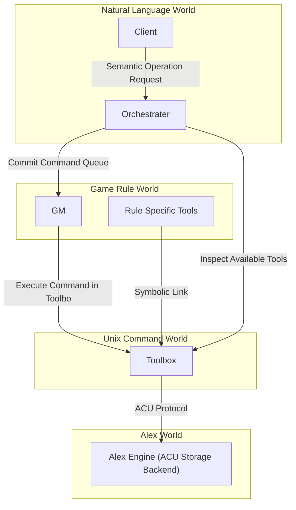
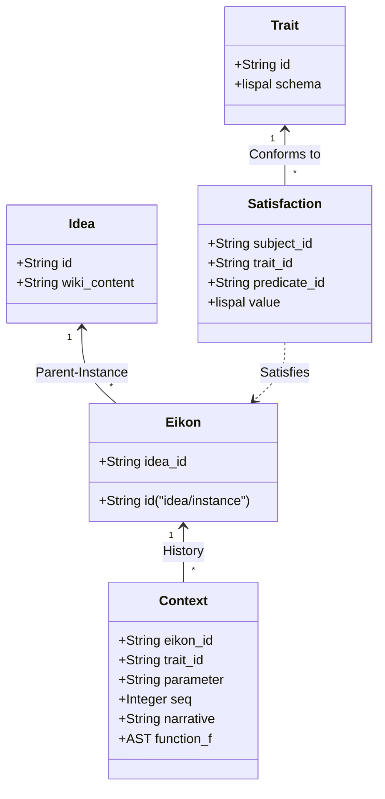

Alexは、言語・意味・状態遷移をUnix哲学に基づいて管理するための知識・状態管理プロトコルである。

本規格では、Alexのデータオントロジーと、Alex Worldを読み書きする唯一の公開規格である Alex Core Utilitiesコマンドプロトコルを定義する。

## 概念オントロジー
Alex Worldのすべての実体と関係は、以下の5つのコア概念によって表現される。

### Trait
データ構造および意味的制約の定義。文における動詞、特にbeや所属関係にあたる。主語単独の属性定義のみならず、主語と述語の間の2項関係、たとえば所属、位置、装備、友好度などを定義する。`[a-zA-Z0-9_-]+`という命名規則に準ずる。

### Idea
単一の抽象概念。Wikiドキュメントと、その概念が持っている静的なTrait充足を保持する。`[a-zA-Z0-9_-]+`という命名規則に準ずる。

### Eikon
Ideaから派生した個別具象実体。親Ideaとの親子関係をID自体に内包する。そのため、命名規則は`[a-zA-Z0-9_-]+/[a-zA-Z0-9_-]+`となる。Traitは動的な付与および剥奪が可能。パラメータの時間的変化の因果履歴をContextとして保持する。

### Satisfaction
ある主語が、Traitによって定義された条件を満たしている状態。すなわち、知識グラフのタプル`(Subject, Trait, [Predicate], [Value/AST])`である。述語が存在する2項関係の場合、主語と述語の双方向から照会可能なリレーショナルタプルとして成立する。

### Context
パラメータの変化をスカラー値の上書きではなく、文脈付き関数 $f(x)$ の構文木の時系列シーケンスとして保持する。初期値はTrait充足時の定義値としたとき、$x$ は前回の評価値を示し、値の変化を関数合成の歴史として追跡可能にする。これにより、状態の監査可能性と因果性の説明可能性を保証する。

## lispal
文脈付きS式を表現するための非チューリング完全Lisp方言。各型は以下の関数を実装する。また、一個前の値、または初期値xが定義される。初期値xの型と返り値f(x)は型が一致することが求められる。

- 共通: 第一引数を破棄し、第二引数の評価値を返却する`=`、および評価時は第二引数を返却する文脈付与`(c "<narrative>" <src>)`
- 小数型: 四則演算`+`、`-`、`*`、`/`。ゼロ除算は終了コード1を返却して異常終了する。
- 整数型: 小数型と同様。ただし、除算の結果が小数になった場合は切り捨てられる。小数への昇格はせず、即座に型エラーで終了する。
- リスト型: 結合`(j <src1> <src2>)`、および0-base、半開区間のスライス`(s <from> <end> <src>)`。
  - from/endの未定義区間へのアクセスは終了コード1を返却して異常終了する。負の数の入力は終端から数えて何番目であるかを意味する。
  - 定義方法は`(l <element> <element> ...)`
- 文字列型: リスト型と同様。
- 辞書型: `(d key value key value ...)`の形式で記述し、dを0としたときの奇数要素は常にkeyとして扱われる。`(g <key> <dict>)`の形式で値を取り出し、`(i <key> <value> <dict>)`の形式で鍵と値のペアが追加された新しい辞書型を得る。

## Alex Core Utilities コマンドプロトコル
Alex Worldに対するすべての操作は、ACUが提供する標準CLIプロトコルを通じて行われなければならない。外部ツールやゲームルールスクリプトが、バックエンドの物理ストレージを直接走査・変更する設計である場合、ACUの実装を変更した場合の結果の同一性は保証されない。

#### `mktr [<trait-id>]`
Make trait。標準入力からTraitスキーマlispalを読み込み、新規Trait IDを発行・登録する。trait-idが与えられていない場合は自動生成する。

#### `mkei [<eikon-id>]`
Make eikon。新規Ideaを発行・登録する。`<idea-id/>`の形式で省略した場合自動生成される。

#### `mkia [<idea-id>]`
新規ideaを発行・登録する。`<idea-id>`を省略した場合自動生成される。

#### `aid [-a] [-t] [-i] [-e] <query>`
Alex ID Search。曖昧ID・プレフィックス検索。

- `-t`: Traitを検索対象に含める。
- `-i`: Ideaを検索対象に含める。
- `-e`: Eikonを検索対象に含める。
- `<query>`が`zaku-ii/`の場合、そのIdeaに属する全Eikonが前方一致検索される。

#### `sfy <subject-id> [-p <predicate-id>] <trait-id>`
Satisfy。主語に対してTraitの実装値lispalを標準出力から渡し、Trait充足関係を永続化する。述語が存在する場合は `-p <predicate-id>` で指定する。検証に失敗した場合は副作用を発生させずに終了コード1を返却する。

#### `dsfy <subject-id> <trait-id> [<predicate-id>]`
De-satisfy。Traitの充足関係を解除する。`<predicate-id>` を指定した場合はその述語との関係のみを解除し、省略した場合は他エンティティからの述語参照を含め、そのTraitに関するすべての関係を一括解除する。

#### `quel <trait-id> ...`
すべてのtraitを実装したeikonを探し、行区切りでeikon-idを標準出力に出力する。

#### `pred <eikon-id> <trait-id>`
eikon-idで指定されたeikonに充足されているtraitの述語となっている行区切りでeikon-idを標準出力に出力する。

#### `mars <infix-formula>`
Marshalling Yard。中置記法で記述された数式を構文木に変換する。構文木の形式はAlex Protocolでは定義されないが、solvおよびparmが解釈できる形式であることが求められる。

#### `xt <eikon-id> <trait-id>/<parameter-name>`
Extend Context。EikonのContextに、標準入力から受け取ったlispal式をc関数ごとの合成関数$f_{c1} \circ f_{c2} \circ \cdots \circ f_{c3}$として解釈し、各関数を一行に対応させたlispal式を追記する。最上位の関数呼び出しは常にc関数であることが求められる。

#### `parm <eikon-id> <trait-id>/<parameter-name>`
Parameter。指定したEikonのTraitおよびパラメータについて、lispal式が一行に一つ書き込まれた文字列を標準出力に出力する。

#### `circ`
標準入力に入力された、1行に1つのlispal式が書き込まれた文字列を受け取り、一行の合成関数に畳み込む。

#### `solv`
Solve。lispal式を標準入力から受け取り、評価して最終的な数値を標準出力に返却する。

#### `wkig -i <idea-id> [-a] [-o <output-path>]`
Wiki Generate。IdeaのMediaWikiテキストをtocに従って結合して標準出力に出力する。`-i <idea-id>` で指定したIdea、または `-a` で全Ideaを対象とする。

#### `dice [<min>] <max>`
Dice。指定された範囲からランダムな整数を1つ出力する。最小値の省略時は1とする。

#### `tox <eikon-id>`
Toolbox。指定されたEikon専用の隔離実行環境であるToolboxのパスを返却する。ディレクトリはオンデマンドで生成される。
